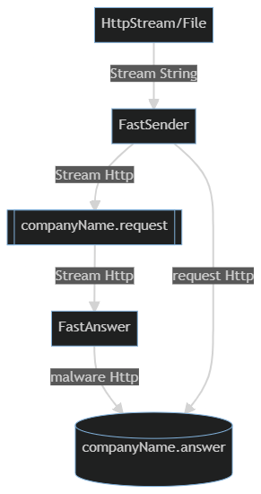
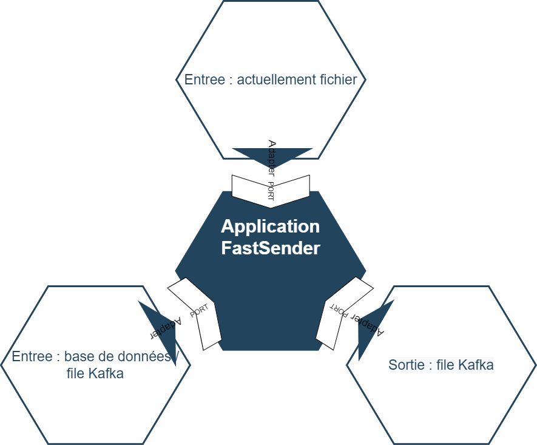

# FastSender
Project for sending data from the client.

# Technology
The project is developed in Java 8, Spark 2.2.0 and Kafka 0.10. 

It is tested with Junit 4.12 and Mockito 2.26.0.

# Architecture
Project for sending HTTP data in a kafka queue from a text file.

Those data are then treated by the FastAnswer project in order to determin
if the HTTP request is provided by a malware. Those data are then
saved in a database. In our case, the database is a Kafka queue. 

The FastSender project read the data from the database in order to 
filter the request from malware.



The component "FastSender" and "FastAnswer" should be put in container 
with docker (for example). It should follow the cloud pattern "automatic
scaling pattern". It allow those components to be horizontally 
scalable.
 
This scalability should be based on one metric : the consumer
offset on the topic "companyName.answer" and the consumer offset on the
topic "companyName.answer".

# Component architecture
The project was developed using the hexagonal architecture :



There are advantage and disadvantage in using the hexagonal architecture :

advantage | disadvantage
--- | --- 
+ Evolutivity : it is easy to add a new technical layer  | - Evolutivity : Every layer should respect the norm defined by the Port design pattern
+ Testability : Each layer can be tested separately | 
+ Reliability : The layers are abstracted from their implementation. |

# Packaging
To package the fat jar, use the following maven command :
``` maven
  mvn package 
```

The fat jar will be created in the target directory.

# Launch the application :
To launch the application, use the following maven command :
``` maven
  java -jar fastSender-1.0.0.jar
```

# Launch the tests :
To launch the test, use the following maven command :
``` maven
  mvn clean install
```